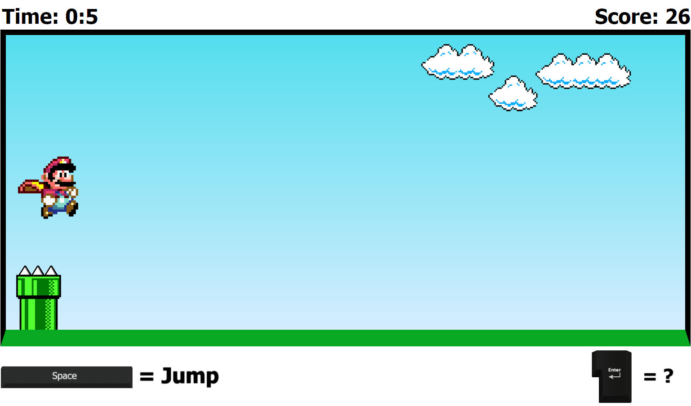
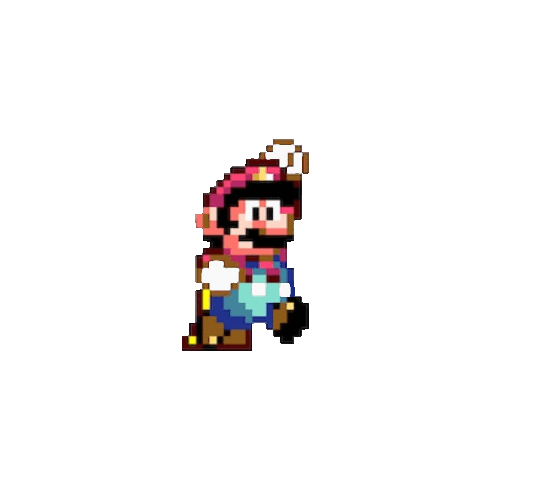
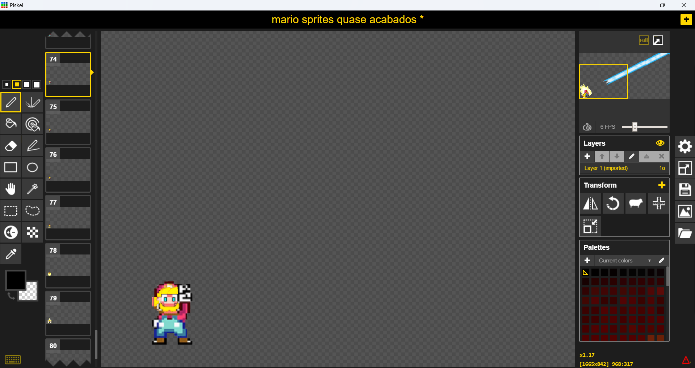

## MARIO JUMP

Olá, a ideia desse projeto surgiu com esse video "[Como criar um jogo SIMPLES usando JavaScript e HTML | JavaScript para iniciantes - Tutorial](https://www.youtube.com/watch?v=r9buAwVBDhA)" do Canal Manual do Dev, onde no video ele nos mostra a criação do game até onde há colisão no jogo e nos incentiva a nós mesmos, dar continuidade ao projeto com nossas ideias e criatividades. Bom, essa aqui é a minha.

Logo de primeira tive ideia de fazer o mario se transformar em ssj, e ai começei a manipular os sprites que achei para criar a animação da transformação e dele voando:

Mais pra frente, apos ja ter feito ele se transformar e se destransformar, tive a ideia de colocar o Bowser para uma mini "cutscene" quando o jogador tivesse alcançado um score alto.

Foi ai que eu passei muitas horas do projeto, procurando um modelo de sprite bom, tendo que editar ele, colocar sobre outro, criando varios outros sprites.
E então mais uma parte demorada e chatinha, a criação da animação. Utilizando o Piskel que é uma ferramenta online de edição de Sprite e Pixel art, começei a animar a do bowser, que era composta por na verdade 4 animações:

1. O Mario parando de voar para observar o bowser chegando.
2. Ele se telestransportanto para tras do bowser e voltando
3. Ele se preparando e lançando um kamehameha no bowser.
4. E a do próprio bowser chegando em cena, tacando uma bola de fogo, se apavorando pra o que ele iria receber e no fim virando poeira.

E apesar de ser bastante complicado ficar editando sprites por sprites para criar uma animação, é bem gratificante quando vejo o resultado final.

Infelizmente após juntar todas as animações para formar a do bowser, a qualidade da imagem acabou não vindo o esperado, pois utilizei o Clipchamp para juntar as animaçoes, mas por usar uma versão gratuita, não pude trazer a animação em 4k, por isso veio meio borrada, e ainda não veio com o fundo transparente, então tive que correr atrás de outra ferramenta online para tirar fundo de gif, e tirou parcialmente bem, apesar de alguns ressalves.

Por ultimo coloquei os sons no jogo, e foi bastante perceptível pra mim, o salto que dá em qualidade um som em um jogo.
Inclusive para a musica de tema, utilizei o audio do video [Super Mario Bros. ROCK VERSION!](https://www.youtube.com/watch?v=YXH-jhz1icE&t=25s) do canal Guitar Geek.